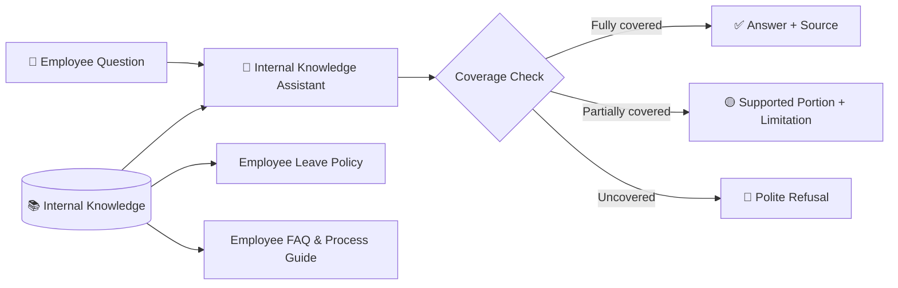

<div align="center">

# 🧠 Internal Knowledge Assistant GPT

### Document-Grounded • Source-Aware • Hallucination-Resistant

<p>
  <a href="https://chatgpt.com/g/g-6ab7ada5cc4c8191b4b3b4501e48f8f5-internal-knowledge-assistant"></a>
  <a href="https://www.loom.com/share/aaf1f04ca35a45619b294cc8fec963a0"></a>
  <a href="https://github.com/shaikshahid777/ai-internal-knowledge-assistant/blob/main/Topic_11_Internal_Knowledge_Assistant_Assessment.pdf"></a>
</p>

<p>
  
  
  
  
</p>

> A Custom GPT designed to answer internal employee questions **only from approved uploaded documentation**, with explicit handling for fully covered, partially covered, and uncovered questions.

</div>

---

## ✨ What This Project Demonstrates

This project implements an **Internal Company Knowledge Assistant** with a strict grounding boundary:

- 📚 Answers are grounded in uploaded internal documents
- 🚫 No external web knowledge
- 🧠 No guessing, speculation, or undocumented policy inference
- 🔎 Bold source references identify the supporting document and section
- 🟡 Partially covered questions return only supported information
- 🔴 Uncovered questions receive a clear, professional refusal
- ⚠️ Conflicting documentation is surfaced instead of arbitrarily resolved

---

## 🏗️ Architecture



### Grounding boundary

```text
Employee Question
       │
       ▼
Uploaded Internal Documents ONLY
       │
       ├── Fully covered    → Answer + bold source
       ├── Partially covered → Supported facts + missing-info notice
       └── Uncovered        → Refuse / documentation unavailable
```

---

## 🧪 Validation

| Scenario | Test | Expected behavior | Result |
|---|---|---|---|
| 🟢 Fully Covered | Annual leave entitlement | Answer from documentation + source | **PASS** |
| 🟡 Partially Covered | Sick leave entitlement/process | Do not invent missing policy | **PASS** |
| 🔴 Uncovered | Remote work policy | Refuse unsupported information | **PASS** |

### **3 / 3 tests passed**

Detailed evidence: [test_results.md](./test_results.md)

---

## 📚 Knowledge Base

| Document | Purpose |
|---|---|
| [employee_leave_policy.md](./employee_leave_policy.md) | Internal leave policy and documented limitations |
| [employee_faq_process_guide.md](./employee_faq_process_guide.md) | Employee FAQ and leave-request process |

The two documents were designed to remain consistent and provide enough coverage to demonstrate all three required testing scenarios.

---

## ⚙️ Instruction & Evaluation

- [instruction_block.md](./instruction_block.md) — complete behavior and grounding rules
- [test_results.md](./test_results.md) — 3-scenario validation evidence
- [Topic 11 Assessment PDF](./Topic_11_Internal_Knowledge_Assistant_Assessment.pdf) — LMS-ready assessment report

---

## 🔐 Safety & Grounding Rules

The assistant is explicitly instructed to:

1. Use only uploaded internal documentation for factual answers.
2. Never use external knowledge to fill gaps.
3. Never invent policies, benefits, eligibility, deadlines, procedures, or contacts.
4. Distinguish fully covered, partially covered, and uncovered requests.
5. Cite supported information using **bold document + section references**.
6. Surface conflicting documentation instead of choosing a version without evidence.
7. Keep responses professional, concise, and transparent about documentation limits.

---

## 🎥 Demo

### Watch the complete walkthrough

**[▶ Open the Loom demonstration](https://www.loom.com/share/aaf1f04ca35a45619b294cc8fec963a0)**

The demo covers:

**GPT configuration → Knowledge files → Fully covered test → Partially covered test → Uncovered test → GitHub evidence**

---

## 🚀 Open the Working GPT

<p align="center">

<a href="https://chatgpt.com/g/g-6ab7ada5cc4c8191b4b3b4501e48f8f5">

</a>

</p>

---

## 📦 Repository Structure

```text
ai-internal-knowledge-assistant/
│
├── 📄 employee_leave_policy.md
├── 📄 employee_faq_process_guide.md
├── 📄 instruction_block.md
├── 📄 test_results.md
├── 📕 Topic_11_Internal_Knowledge_Assistant_Assessment.pdf
└── 📘 README.md
```

---

## 🎯 Assessment Deliverables

| Requirement | Status |
|---|---|
| Working Custom GPT | ✅ Complete |
| Policy knowledge document | ✅ Complete |
| FAQ/process guide | ✅ Complete |
| Strict document-only scope | ✅ Complete |
| Refusal rules | ✅ Complete |
| Bold source-citation rule | ✅ Complete |
| Fully covered test | ✅ PASS |
| Partially covered test | ✅ PASS |
| Uncovered test | ✅ PASS |
| test_results.md | ✅ Complete |
| Loom demonstration | ✅ Complete |
| LMS assessment PDF | ✅ Complete |

---

## 🧩 Challenges & Resolutions

### Challenge 01 — Preventing hallucination
**Resolution:** Strict document-only instructions, explicit refusal rules, and disabled Web Search.

### Challenge 02 — Handling partial coverage
**Resolution:** The assistant was instructed to answer only the supported portion and explicitly identify information that is not documented.

### Challenge 03 — Transparent evidence
**Resolution:** Every supported factual response must include a **bold source reference** containing the document and relevant section.

---

## 📌 Project Scope

This repository is an **assessment implementation** demonstrating document-grounded Custom GPT behavior. The uploaded documents are sample internal-company-style assessment documents, not a real company's confidential policies.

---

<div align="center">

### Built as a Topic 11 Custom GPT Assessment

**Document Grounding · Source Transparency · Safe Refusal · Evaluation**

</div>
